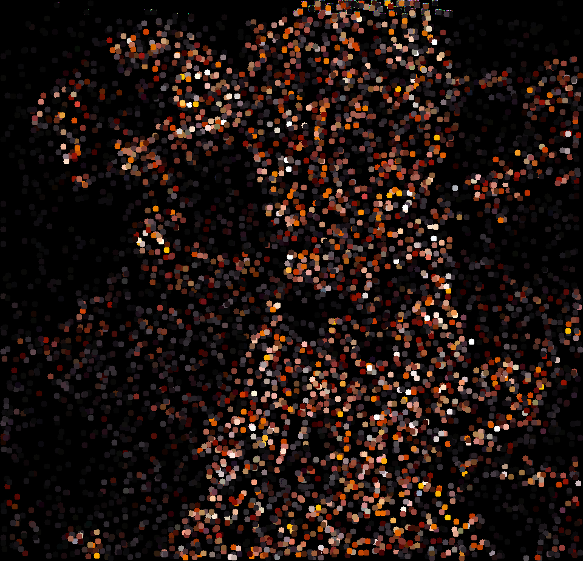
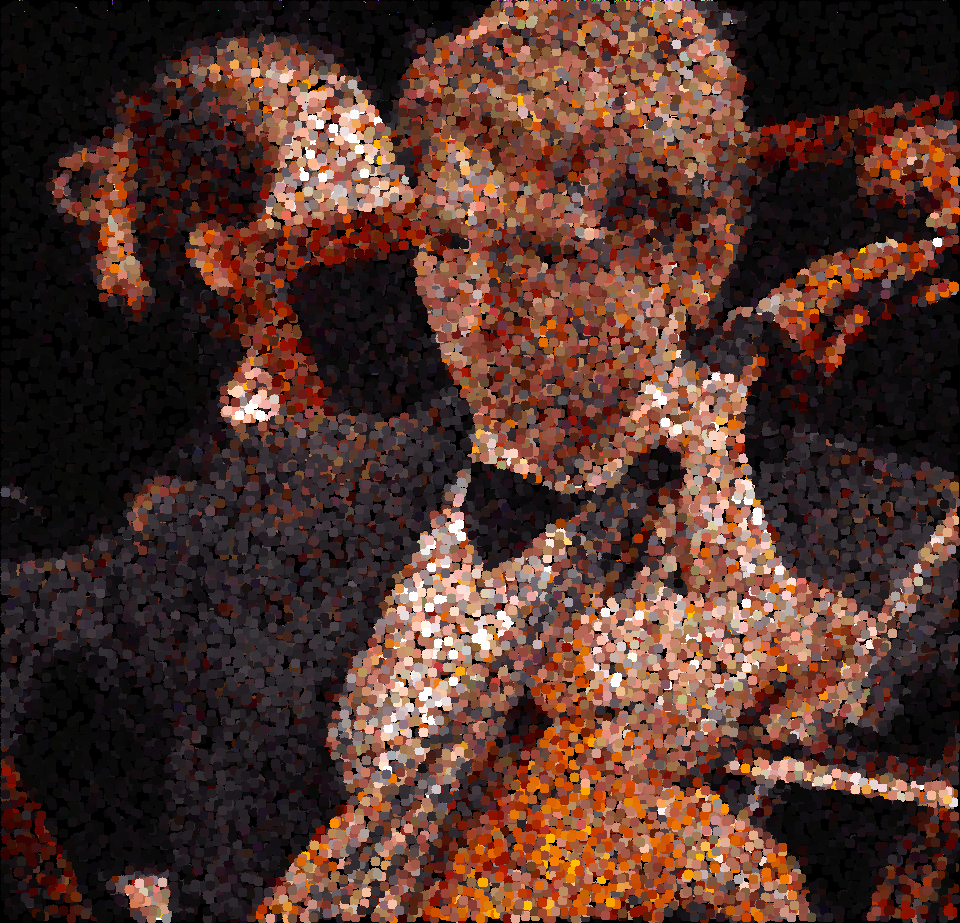
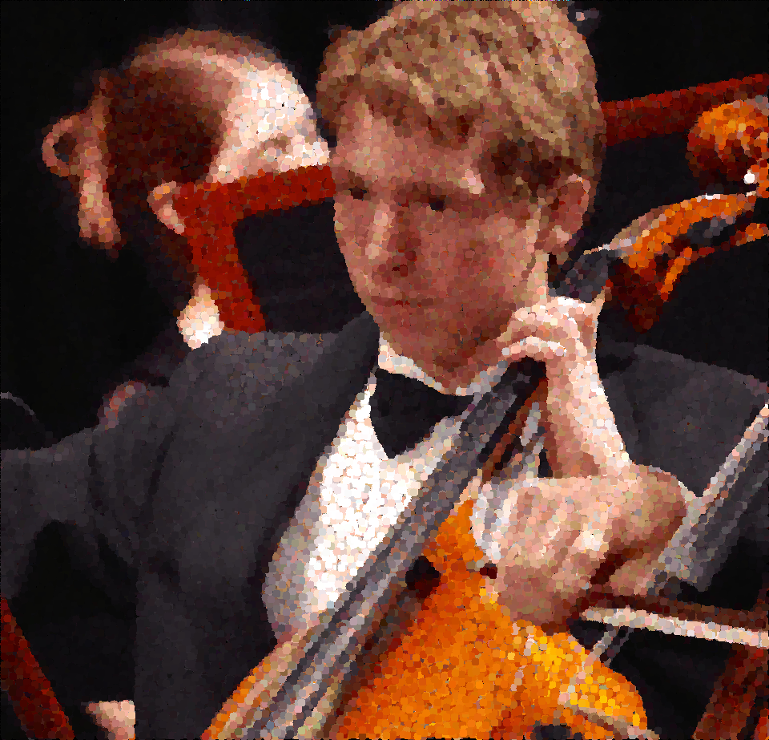

# dotter

Takes an image and tries to approximate it with circles.

Requires libpng

## Arguments

`./dotter [input.png] [output.png] [iterations] [radius] [make_slices]`

Don't forget to pull in the submodules before compiling.

## Procedure

Load an entirely black image into variables img1 and img2.

Pick a random color in the input image, and draw a dot of that color at a random position in img1.

Compare img1 to the source and compare img2 to the source.

If img1 is a closer approximation to the source, copy img1 to img2. Otherwise, copy img2 to img1.

Repeat for the given number of iterations

## Optimizations

Only the affected pixels need to be copied between the images, and only the affected pixels need to be compared.

I implement both of these optimizations, which vastly decrease runtime

## Samples

10000 iterations

100000 iterations

1000000 iterations

